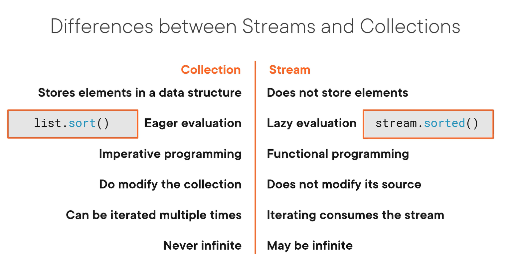

# Notes about Working with Streams and Lambda Expressions in Java Course

[Working with Streams and Lambda Expressions in Java (Java SE 11 Developer Certification 1Z0-819)](https://app.pluralsight.com/library/courses/streams-lambda-expressions-java-se-11-developer-certification-1z0-819/table-of-contents)


## 04. Working with Streams - The basics

Process a sequence of elements by different kind of operations.

### Understanding streams

#### Stream pipeline

```
products.stream()
  .filter(product -> product.getCategory() == Category.FOOD)
  .map(Product::getName())
  .forEach(System.out::println);

```

interface java.util.stream

#### Intermediate and terminal operations

Streams doesn't produce elements unless there is a terminal operation.

```
Intermediate operations
  .filter(product -> product.getCategory() == Category.FOOD)
  .map(Product::getName())

Terminal operation
  .forEach(System.out::println);
```

### Differences between streams and collections



#### Internal vs external iteration

**External iteration:** the iteration is not controlled by the collection itself

```
for (int i=0; i< products.size(); i++) {
  Product p = products.get(i);
  System.out.println(p);
}
```

**Internal iteration:** the iteration is controlled by the stream itself

```
products.stream()
  forEach(System.out::println);
```

### Obtaining streams

Factory methods: Stream.of(), Stream.ofNullable()

https://github.com/amartellram/pluralsight-java-cert/blob/274f1fba63a3a727f1a3069ca9667871cbf3f662/src/main/java/streams/BasicStreamSample03.java#L17-L36

### Filtering and transforming streams

* **filter:** intermediate operation, takes a predicate to filter
* **map:** one-to-one transformation. It takes a function and transform each element in the stream
* **flatMap:** one-to-many transformation.

https://github.com/amartellram/pluralsight-java-cert/blob/7681cfe01425c8e9bdf02ea2510ae54785e8189e/src/main/java/streams/BasicStreamSample03.java#L19-L40

### Searching in streams

* find a particular element : filter(...) , findFirst() or findAny()
* Check if element exists anyMatch(...), allMatch(...), noneMatch(...)

https://github.com/amartellram/pluralsight-java-cert/blob/0f06e70b7e29deb99cf0f5fd285b14b6cdd46ee5/src/main/java/streams/BasicStreamSample04.java#L14-L35

### Reducing and collecting streams

https://github.com/amartellram/pluralsight-java-cert/blob/2fca860f4317bb1d965751251fffc9e60ab4ccf9/src/main/java/streams/BasicStreamSample05.java#L14-L26

## 05. Working with streams - In depth

### Generating and building streams

https://github.com/amartellram/pluralsight-java-cert/blob/0215f4780f3afb53478d311d0cc305c1248c9235/src/main/java/streams/AdvancedStreamsExample01.java#L10-L25

### Reducing streams in detail

https://github.com/amartellram/pluralsight-java-cert/blob/0215f4780f3afb53478d311d0cc305c1248c9235/src/main/java/streams/AdvancedStreamsExample02.java#L15-L35

### Collecting streams in detail

Collect = mutable reduction. A collection operation reduces a stream into a mutable result container

Reduce = immutable reduction

https://github.com/amartellram/pluralsight-java-cert/blob/0215f4780f3afb53478d311d0cc305c1248c9235/src/main/java/streams/AdvancedStreamsExample03.java#L14-L30

### Working with collectors

Collector: Is an object that provides the set of functions necessary for a specific kind of collection operation.

Parts:

* **Supplier:** creates a new mutable result container.
* **Accumulator:** update the result container with the result element.
* **Combiner:** combines two intermediate result containers. It's necessary for parallel streams.
  For each thread, a separate result container will be created, and after processing, the intermediate result need to be combines into a single result.
* **Finisher:** last step of the collection operation after the combiner has been called to combine all the intermediate results.
  Perform a final step processing if necessary to create a final result.

Samples:

* `toList()`
* `toSet()`
* `toMap()`

#Advanced example 04

### Grouping stream elements

#Advanced example 05

### Partitioning stream elements

Partitioning is a special form of grouping in which you use a predicate as the classifier function
which results in two groups.

#Advanced example 06

### Parallel streams

A parallel stream can execute stream operations in multiple threads in parallel.

* Thread management and communication **overhead**.
* Only likely to be beneficial when **limited by CPU**.
* **Measure** is it is beneficial for your use case.

Use `Collectors.groupingByConcurrent()` in parallel streams. It's an unordered collector.

``` java
Map<Category, List<Product>> productsByCategory =
  products.parallelStream().collect(
      Collectors.parallelStream().collect(
          Collectors.groupingByConcurrent(Product::getCategory));
```

### Specialized streams

Some streams are specialized for primitive types. Exist to avoid boxing and unboxing.

`IntStream` `LongStream` `DoubleStream`

#Advanced example 07

## Course summary

Lambda expression
* A lambda expression is an **anonymous method**.
* A lambda expression implements a functional interface.
* A functional interface has a **single abstract method**.

Method references
* Use a method reference instead of a lambda expression.
* A method reference **implements a functional interface**.
* Refers to a **static** or **non-static method** or a **constructor**.